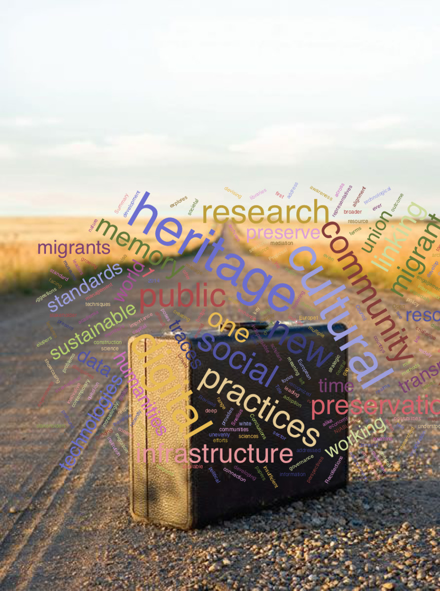

# Welcome to Migrant: Mobilities and Connection

_a project of the Huygens Institute for the history of the Netherlands_

Migration from the Netherlands to Australia has many facets. This project focuses on immigrants who moved to Australia from the post-war Netherlands and their life histories. These life histories can be reconstructed on the basis of the registration systems used at the time. In these systems, records were kept for the migrants from the moment they applied to the moment that they settled in their new home country – and sometimes even long afterwards. These records show how migrants fared after arriving in Australia, both individually and as a group. _‘Migrant: Mobilities and Connection’_ is intended to allow for the comparison of different subgroups in a longitudinal perspective on the basis of e.g. origins, religion or health. By taking the migrants’ cultural heritage on board in the study, the project is intended to cast new light on the circulation and adaptation of Dutch values in a new environment, and how these values – changed and enriched by new experiences – then found their way back to the Netherlands via the migrants’ contacts with their country of origin.

The registration systems – a database with emigrant registration cards (National Archives of the Netherlands, The Hague) and Australian migrant dossiers (National Archives Australia) – form the starting point for the research project and ensure that the various substudies remain closely interrelated. The project is both interdisciplinary and international in character, involving collaboration between Dutch and Australian historians, literary scholars and Digital Humanities experts of Huygens ING, Leiden University, the Edith Cowan University, Perth, Curtin University, Perth en Western Sydney University. Although the project has a scholarly background and structure, it also holds direct importance for the Dutch migrant community in Australia. After all, the database with migrants’ lives relates to their history. In turn, this community can not only supplement and improve the database via crowd sourcing, but also provide new research material by sharing physical and digital sources such as photographs, journals and memorabilia.
